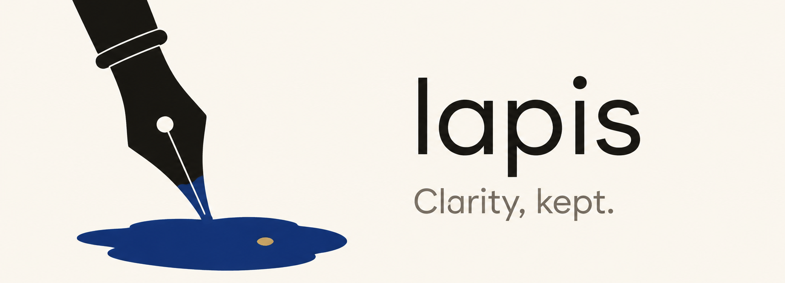

<p align="center">
  <picture>
    <source media="(prefers-color-scheme: dark)" srcset="./banner-dark.png">
    
  </picture>
</p>

<p align="center">
  <a href="https://github.com/zexadev/lapis/releases/latest">
    
  </a>
  <a href="https://github.com/zexadev/lapis/releases">
    
  </a>
  
  
</p>

<p align="center">
  
  
  
  
  
  
</p>

<p align="center">
  <a href="./README.md">中文</a> •
  <a href="./README_EN.md">English</a>
</p>

<p align="center">
  <a href="https://jdnotes.zexa.cc">Docs</a> •
  <a href="#-features">Features</a> •
  <a href="#-download">Download</a> •
  <a href="#-quick-start">Quick Start</a> •
  <a href="#-tech-stack">Tech Stack</a> •
  <a href="#-feedback">Feedback</a>
</p>

---

## About

**Lapis** is a local-first desktop note-taking app built with Tauri 2. Sync across devices over LAN or encrypted P2P — and let AI agents read and write your local notes via MCP. All data is stored locally on your device — no cloud, no tracking, full privacy.

| | Feature | Description |
|---|---|---|
| :arrows_counterclockwise: | **Multi-Device Sync** | LAN auto-discovery + encrypted cross-network P2P, free, no central server |
| :electric_plug: | **AI Agent Read/Write** | Built-in MCP Server — Claude Code, Cursor and other AI tools can view, create, append and edit notes in your local library |
| :link: | **Bi-directional Links** | Type `[[` to reference other notes (or write `[[Title]]` inline), click to jump + automatic backlinks |
| :robot: | **AI-Powered** | Multi-provider AI assistant: DeepSeek / Claude / Gemini / Ollama |
| :lock: | **Local-First** | Local SQLite storage, works offline, your data stays on your device |
| :rocket: | **Lightweight** | Built with Rust + Web tech, ~8MB installer, fast startup |

---

## Features

### Rich Text Editing

- **Markdown** — Native Markdown support, WYSIWYG editing
- **Toolbar** — Text formatting, lists, quotes, code blocks, images
- **Code Highlighting** — 20+ programming languages with CodeMirror
- **Images** — Insert via toolbar, paste, or drag & drop with resize support
- **Task Lists** — `- [ ]` / `- [x]` syntax, toolbar and slash commands
- **Slash Commands** — Type `/` to quickly insert content blocks and AI commands
- **Code Paste as Code Block** — Pasting code from VS Code and similar editors creates a highlighted code block automatically; plain text with ``` fences is recognized too
- **Links** — Ctrl+Click to open links (VS Code style); hovering a link shows an action card to open, copy, edit or unlink
- **Note References / Bi-directional Links** — Type `[[` to pick a note, or write `[[Title]]` as plain text (including notes written by AI via MCP); both render as clickable chips, and referenced notes list their backlinks automatically
- **Auto Save** — Real-time save, never lose your work

### Multi-Device Sync

- **mDNS Auto-Discovery** — Devices running Lapis on the same WiFi find each other automatically, no IP typing
- **Selective Sync** — Pick exactly which notes to send via search / select-all / per-note checkboxes
- **Cross-Network P2P** — Encrypted direct connection between different networks (built on iroh: NAT hole-punching with relay fallback)
- **Per-Note Push** — A push button in the editor header sends the current note to a device
- **Conflicts Keep Both** — Concurrent edits produce a "conflict copy" note, data is never silently dropped
- **Pairing Code** — On first sync both devices show a 6-digit code; sync proceeds only if they match (MITM protection)
- **Private Notes** — Notes marked private never leave this machine
- **Sync Packages** — Export/import sync package files to move notes offline via USB drive
- **Online Status** — Cross-network device list shows online/offline in real time
- **Persistent Device Fingerprint** — The same machine stays the same device across restarts

### AI Assistant

- **Multi-Provider** — DeepSeek, OpenAI, Anthropic Claude, Google Gemini, Ollama
- **Multiple Sources** — Configure and switch between AI providers instantly
- **Inline Rewrite** — Select text, press `Ctrl+J` and give an instruction: AI rewrites in place with the original struck through in red and new text streaming in green; Tab to accept, Esc to discard, retry or refine with follow-up instructions
- **Sidebar Conversations** — Multiple conversations (`Ctrl+L`) with automatic naming and quick switching; paste or drag images into the chat
- **AI Reads/Writes Notes** — In chat, AI can query, create and append to your notes directly
- **Context Compaction** — Long conversations are compacted into a summary automatically; the input card shows live context usage
- **AI Actions** — Continue writing, rewrite, summarize, translate, Q&A
- **Auto Title** — AI generates note titles and tags automatically

### MCP Server

- **Built-in HTTP MCP Server** — Starts automatically on `127.0.0.1:19230`
- **Auto Registration** — Registers with Claude Code, Cursor, Windsurf and 9 other AI tools on startup
- **6 Tools** — Read (`get_note`, `search_notes`, `list_notes`) + Write (`create_note`, `append_note`, `update_note`)
- **Agent Skill Auto-Install** — Automatically installs Agent Skill to Claude Code, Copilot, Gemini CLI on startup
- **AI Tool Integration** — Say "view my notes" or "save this to notes" in Claude Code

### Dashboard

- **5 KPIs at a Glance** — Total notes, word count, writing days, active tags, streak
- **Writing Heatmap** — Daily activity over the past 90 days
- **7-Day Trend** — Line chart of your weekly rhythm
- **24h Distribution** — Find your most productive hours
- **Top 5 Tags** — Most used tags by frequency
- **Recent Notes** — One click to open

### Calendar View

- **Month View** — Overview of notes across the month
- **Week View** — Plan your week
- **Day View** — Focus on today's tasks

### Note Management

- **Global Search** — Find notes instantly (`Ctrl+K`)
- **Favorites** — Star important notes
- **Trash** — Recover deleted notes
- **Tags** — Flexible categorization with automatic, consistent tag colors
- **Reminders** — Set timed reminders for notes

### Export

- **PDF** — Export via browser print
- **Markdown** — Export as `.md` files

### Personalization

- **Themes** — Dark/light mode with animated toggle
- **Auto Update** — In-app update checker
- **Changelog** — Browse release notes inside the app

---

## Download

### Windows

Download the latest version from [Releases](https://github.com/zexadev/lapis/releases/latest):

| File | Description |
|------|-------------|
| `Lapis_x.x.x_x64-setup.exe` | Windows Installer (recommended) |
| `Lapis_x.x.x_x64_en-US.msi` | Windows MSI Installer |

**Requirements:** Windows 10/11 (64-bit)

---

## Quick Start

### Installation

1. Download the latest installer from [Releases](https://github.com/zexadev/lapis/releases/latest)
2. Run the installer and follow the prompts
3. Launch Lapis and start writing

### Configure AI

1. Open Settings (gear icon at bottom-left)
2. Add an AI source in "AI Settings"
3. Supports DeepSeek, OpenAI, Anthropic, Google, Ollama and more

### Using MCP Server

Lapis automatically starts an MCP Server on `127.0.0.1:19230` and registers with Claude Code. Just say "save this to notes" in Claude Code.

Manual registration:
```bash
claude mcp add --transport http lapis http://127.0.0.1:19230/mcp
```

### Keyboard Shortcuts

| Shortcut | Action |
|----------|--------|
| `Ctrl+K` | Global Search |
| `Ctrl+L` | Toggle AI Sidebar |
| `Ctrl+J` | Inline AI Prompt (with selection) |
| `Ctrl+\` | Cycle Sidebar (expand/collapse/hide) |
| `F11` | Immersive Mode (distraction-free fullscreen) |
| `Ctrl+B` | Bold |
| `Ctrl+I` | Italic |
| `Ctrl+Shift+C` | Code Block |
| `Ctrl+Click` | Open Link |
| `/` | Slash Command Menu |

---

## Tech Stack

<table>
  <tr>
    <th>Layer</th>
    <th>Technology</th>
    <th>Description</th>
  </tr>
  <tr>
    <td rowspan="5"><strong>Frontend</strong></td>
    <td></td>
    <td>UI Framework</td>
  </tr>
  <tr>
    <td></td>
    <td>Type-safe JavaScript</td>
  </tr>
  <tr>
    <td></td>
    <td>Utility-first CSS</td>
  </tr>
  <tr>
    <td></td>
    <td>Rich Text Editor</td>
  </tr>
  <tr>
    <td></td>
    <td>Build Tool</td>
  </tr>
  <tr>
    <td rowspan="4"><strong>Backend</strong></td>
    <td></td>
    <td>Desktop App Framework</td>
  </tr>
  <tr>
    <td></td>
    <td>Systems Programming</td>
  </tr>
  <tr>
    <td></td>
    <td>Embedded Database</td>
  </tr>
  <tr>
    <td></td>
    <td>Model Context Protocol Server</td>
  </tr>
  <tr>
    <td><strong>AI</strong></td>
    <td></td>
    <td>DeepSeek / OpenAI / Claude / Gemini / Ollama</td>
  </tr>
</table>

---

## Feedback

If you encounter any issues or have suggestions:

- Submit a [GitHub Issue](https://github.com/zexadev/lapis/issues/new)
- Visit the [Documentation](https://jdnotes.zexa.cc)

### FAQ

<details>
<summary><strong>Q: Where is my data stored?</strong></summary>
<p>All data is stored in a local SQLite database at <code>%APPDATA%/com.jdnotes.app/</code>. You can change the storage location in Settings.</p>
</details>

<details>
<summary><strong>Q: Which AI providers are supported?</strong></summary>
<p>DeepSeek, OpenAI (and compatible APIs), Anthropic Claude, Google Gemini, and Ollama for local models. You can configure multiple sources and switch between them.</p>
</details>

<details>
<summary><strong>Q: How does the MCP Server work?</strong></summary>
<p>Lapis automatically starts a local MCP Server and registers with Claude Code on launch. Just say "save this to notes" in Claude Code to use it.</p>
</details>

---

## License

Lapis **2.0 and later** is licensed under the **[GNU AGPL-3.0-or-later](LICENSE)** (strong copyleft: modifying, distributing, or offering it over a network all require releasing your changes under the AGPL).

Additional term (AGPL §7, see [NOTICE](NOTICE)): when you modify or distribute Lapis, you must **keep an attribution to the original author and project in your repository's README / source / NOTICE** (`Based on Lapis — © 2026 zexadev — https://github.com/zexadev/lapis`) and mark your changes. Displaying it inside the app UI is not required.

Earlier releases — **version 1.9.1 and before** — were published under the [MIT License](LICENSE-MIT) and remain available under those terms.

Copyright © 2026 [Zexa (zexadev)](https://zexa.cc)

---

## Acknowledgements

Thanks to these open-source projects:

<p>
  <a href="https://tauri.app/"></a>
  <a href="https://react.dev/"></a>
  <a href="https://tiptap.dev/"></a>
  <a href="https://tailwindcss.com/"></a>
  <a href="https://lucide.dev/"></a>
</p>

---

<p align="center">
  Made with :heart: by <a href="https://zexa.cc">Zexa</a>
</p>

<p align="center">
  <a href="https://github.com/zexadev/lapis">
    If this project helps you, please give it a Star :star:
  </a>
</p>
